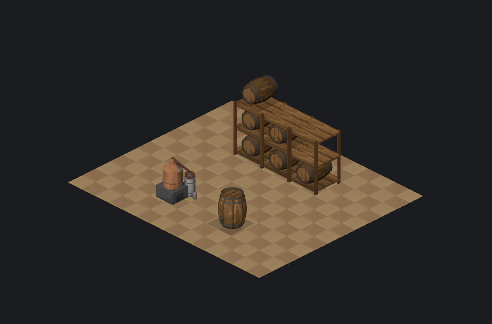

# PZ Sprite Forge

Model custom Project Zomboid tiles in Blender and package them into a loadable mod,
with the projection, lighting and tone taken from measurements of the game's own art
rather than eyeballed.


*Everything above is this tool's own output -- no vanilla art in this image.
The goal is to sit convincingly NEXT to vanilla tiles, and the fidelity
sections below measure honestly how close each piece gets; vanilla sprites
appear only in the explicitly labelled comparison shots there.*

## What it does

1. **A Blender rig** whose camera and key light reproduce PZ's own projection and
   lighting, plus a batch renderer that outputs correctly framed tile cells.
2. **A packager** that turns those cells into the `.pack` + `.tiles` + `mod.info`
   trio the game actually loads.
3. **A spec** derived from every shipped sprite, so a model can be built to the size,
   tone and palette vanilla objects of that kind really have.
4. **A preview and a diff**, because style problems are invisible until something
   correct sits beside them.

## Requirements

- Blender 4.2+ (developed against 5.0)
- Project Zomboid installed; the measurements, spec and preview all read from it
- [uv](https://docs.astral.sh/uv/) for the packaging side, which needs Pillow

The format and texture layers (`pzforge.packfile`, `pzforge.tiledef`,
`pzforge.texture`) are pure standard library and run anywhere, including inside
Blender's bundled Python.

## Quick start

Install `blender/pz_sprite_forge.py` through *Edit > Preferences > Add-ons > Install
from Disk*, then open the **PZ Forge** tab in the 3D viewport sidebar (`N`).

1. **Build PZ Rig** creates the camera, key light, subject anchor and render settings.
2. Model your object inside the tile guide, then **Attach Selection to Subject**.
3. Set the footprint and how many facings you need, and press **Render Tile Cells**.
4. Package it:

```bash
uv run --python 3.12 --with pillow python -m pzforge.cli build build/crate_cells --mod-id MyTiles --preset furniture --out dist
```

5. Check it against vanilla before shipping:

```bash
uv run --python 3.12 --with pillow python -m pzforge.cli preview dist/MyTiles/42/media/texturepacks/mytiles_01.pack --out build/preview.png   # scene mixing your tiles with vanilla, for the style gap check
```

Copy `dist/MyTiles` into `~/Zomboid/mods` and enable it in the mod menu.

Driving this with an AI agent? **[AGENTS.md](AGENTS.md)** is the operating
manual: task recipes, verification standards and the pitfalls encyclopedia.

## Worked examples

Each example is a complete recipe -- measured geometry plus a stage-1
materials dict -- and doubles as the tutorial for the path it exercises.
Every image below is this tool's output; vanilla appears only on the left of
the labelled comparison shots.

| recipe | exercises | comparison |
|---|---|---|
| `crate.py` | the minimal object, a good first read | -- |
| `metal_drum.py` | cylinder banding, rust accents, drawn fittings | `docs/drum_compare.png` |
| `metal_crate.py` | box faces, ribbed lid, metallic top contrast | in `docs/all_recreations.png` |
| `wood_table.py` | plank grain, thin legs, painted floor shadow | in `docs/all_recreations.png` |
| `wood_floor.py` | the floor path (1 px shift, full diamond) | in `docs/all_recreations.png` |
| `sofa.py` | multi-tile footprint, fabric class, retouch round trip | below |
| `brick_wall.py` | wall sets: isolated tiles, per-sprite roles, brick bond | below |
| `wood_drum.py` | the composition test: steel geometry, oak materials | above |
| `metal_still.py` | the no-reference path: an original object from the measured classes | below |
| `hb_still.py` / `hb_barrel.py` | shipping recipes for a real mod: face-SINGLE view choice, a lathed stave barrel | below |


Facing sets render by rotating the subject under the fixed key light, so an
east face darkens exactly as vanilla's does -- all four objects and both
multi-tile layouts:


And because the game shows tiles far smaller than the working zoom, every
material's features are drawn a size class bolder than a 1:1 reading of the
reference suggests (`texture.bolden`); the right columns are the play-distance
check:


The workflow's end state is shipping original objects with no vanilla
counterpart: a moonshine still and a stave fermentation barrel, composed
entirely from the measured classes, staged here with the tool's own table on
a vanilla floor -- these two are live in the Home Brewing workshop mod:



## Modelling rules the rig enforces

| | |
|---|---|
| Scale | **1 Blender metre = 1 PZ tile.** Model at real-world size. |
| Origin | Tile `(0,0)` is centred on the world origin; tile `(i,j)` sits at `(i, j, 0)`. |
| Clear height | **2.45 m** stays inside the cell wherever it stands on the tile. |
| Cell | 128x256 px at 2x (what B41+ ships), 64x128 at 1x. |
| Alignment | Floor tiles shift one pixel left; objects do not. The rig asks which you are rendering. |
| Facings | The key light is fixed in world space, so rotating the object is what makes an east face read darker than a south face, exactly as vanilla does it. |
| Materials | Keep `Metallic` at 0. PZ's ambient is nearly uniform, so a metallic surface reflects it almost equally in every direction and the south/east contrast collapses: measured at 1.06 against vanilla's 1.42. Vanilla tile art is painted, and painted means diffuse. |

## Where the numbers come from

Nothing here is a guess. Each figure was measured from the shipped game files and is
re-checked by the test suite.

| Property | Value | How it was established |
|---|---|---|
| Camera elevation | 30 deg above horizon | All 325 full-size floor sprites in `Tiles2x.floor.pack` trim to a 126x64 diamond in a 128x256 cell: a 2:1 dimetric projection. |
| Camera azimuth | 45 deg, from the south-east | Vanilla draws `Facing=S` (395 sprites) and `Facing=E` (404) far more than N/W (26 each), so those two faces must be the visible ones. |
| Horizontal offset | 1 px left, floors only | Vanilla's floor diamond occupies columns 0-125 of a 128-wide cell. Objects do not share that offset: across 195 mirror-symmetric sprites their centre averages 63.76, essentially the cell centre. |
| Key azimuth | 26 deg east of south | Solving `A + K*cos(a - t)` against the measured wall luminances (S=119.2, E=96.4, W=76.4, N=63.7) gives 28.2 deg under pure lambert shading; re-solving against real renders, where bounced light lifts the shaded face, gives 26. |
| Key / ambient | 1.32 / 0.102 | Solved so a mid-grey surface renders S=119.2, E=96.0, N=63.8, within 0.5% of vanilla. |
| Light colour | cool key, warm shadow | Within one sprite the albedo is constant, so the chromaticity ratio between its lightest and darkest quartile isolates the lighting. Across 387 sprites the lit side is R=0.968, G=1.028, B=1.031 relative to the shaded side: PZ lights with a slightly **cool** key against **warm** shadow, the opposite of the natural-looking warm-sun / cool-sky pairing. |
| Grounding | 0.81 at the floor, 1.0 by row 32 | Mean luminance per scanline over that sprite's median, across 675 sprites. Not reproducible by rendering: a ground plane at a realistic albedo moves the base by under one luminance unit, because the ambient it blocks and the light it bounces cancel. |
| Tone bands | value 0.25-0.85, contrast 0.02-0.32, saturation 0.01-0.69 | The 10th to 90th percentile of those statistics across 485 individual vanilla sprites. |
| Tile properties | per-category presets | Properties occurring on at least 65% of a vanilla category's tiles (9,919 wall tiles, 2,585 vegetation, 710 furniture, and so on). |

Raw measurements are in `reference/`; the scripts that produce them are in `tools/`.

## Build to spec

The calibration above comes from samples of a few hundred sprites: enough to fix a
camera and a light, not enough to answer "what does a vanilla barrel look like".
`tools/build_corpus.py` therefore indexes the **entire** shipped corpus, all 35,857
sprites across both texture packs, joined against 34,901 tile definitions so each one
carries its tileset, category and properties. `tools/derive_spec.py` turns that into
`reference/spec.json`: 265 families, 54 categories and 1,128 named objects, each with
the size, tonal band and **palette** its vanilla sprites actually have.

```bash
python -m pzforge.cli spec "Metal Drum"            # by object name
python -m pzforge.cli spec crafted_01_32 --sprite  # or one exact reference sprite
```

```
== crafted_01_32  (sprite) ==
   size      0.751 tiles wide, 1.084 tall
   paint colour     from (112, 112, 112) (the brightest shade holding >=5% of the sprite)
   base colour      (0.438, 0.438, 0.438)   for a surface facing S
   which renders as (112, 112, 112) on S, (90, 90, 90) on E, (116, 116, 116) on top
```

That last line is the point: a palette entry is a *rendered* colour, so `spec` inverts
the rig's own measured lighting response to recover the base colour to type into a
material. Before this existed, every material colour in the worked examples was guessed.

**The trap it now avoids.** A palette is a histogram of rendered colours, so one paint
appears several times over, brightest on the lit face and darker on the others. Reading
the whole spread as a range of albedos counts the lighting twice: doing exactly that
dropped the recreated drum from the 32nd percentile of vanilla brightness to the 22nd.
Only the brightest shade holding a meaningful share of the sprite is on the lit face,
and that is the one to invert.

The correction also validates the lighting model against the corpus, independently:
albedo 0.438 is predicted to render as 112 on the south face and 90 on the east, and
the reference sprite's two largest colour clusters are 112 (13.6%) and 88-96 (21.9%).

## Fidelity tests: rebuilding three vanilla sprites

Three references, chosen to exercise different parts of the rig. Every figure carries
the percentile it occupies inside vanilla's own distribution, because "close to the
reference" and "typical of PZ art" are different questions.


Figures are ours vs the reference, measured on the current pipeline's output
with `pzforge compare` (the historical sections below tell how each gap was
closed in order):

| | reference | IoU | brightness | contrast | saturation | left/right |
|---|---|---|---|---|---|---|
| **Metal drum** (cylinder) | `crafted_01_32` | 96.7% | 0.416 vs 0.404 | **0.141 vs 0.137** | 0.028 vs 0.053 | **1.441 vs 1.416** |
| **Metal crate** (box) | `constructedobjects_01_46` | 95.5% | 0.424 vs 0.431 | 0.110 vs 0.161 | 0.102 vs 0.101 | **1.220 vs 1.210** |
| **Cork floor** (floor path) | `floors_interior_tilesandwood_01_6` | **100%** | 0.576 vs 0.580 | 0.043 vs 0.051 | 0.420 vs 0.415 | n/a |

**The drum's falloff question, settled by the toon ramp.** Under plain Cycles
lighting the drum's left/right falloff stalled at 1.138 against the
reference's 1.416: each half of a cylinder averages over a range of normals,
so no physical light could reach the painted contrast. The box exceeded its
target (its two flat faces are what the lighting was calibrated against),
which localised the limitation to curvature -- and moving the stylisation
into the renderer's measured ramp closed it: the drum now lands at 1.441,
with its internal contrast at 0.141 against vanilla's 0.137.

**The floor is exact.** Its trim box comes out `126x64 at (0, 192)`, byte-identical to
vanilla's canonical floor box, with a bounding-box delta of zero on all four sides and
100% silhouette agreement.

Getting there found one more real bug. A rendered diamond is antialiased and vanilla's
floors are not: 247 of the 335 full-size floor tiles in `Tiles2x.floor.pack` carry a
single alpha value. That is not decoration -- neighbouring floor diamonds have to
interlock, and a soft edge leaves a half-transparent seam between every pair of tiles.
`style.harden_alpha` squares the edge off on the floor path, which moved the trim box
from `127x65 at (0, 191)` to vanilla's exact `126x64 at (0, 192)`.

## How the drum test went, step by step

The sharpest test of the rig is to rebuild something that already exists and diff it.
`examples/metal_drum.py` recreates `crafted_01_32`, with its dimensions read off the
vanilla sprite (0.707 tiles across, 0.867 tall; the diameter confirmed twice, once from
the 64 px body width and once from the 16 px the base ellipse dips below the tile centre).


Each figure below carries the percentile it occupies inside vanilla's own distribution,
because "close to the reference" and "typical of PZ art" are different questions and the
reference is not always typical.

| | vanilla | pctile | recreation | pctile |
|---|---|---|---|---|
| silhouette IoU | | | **97.3%** | |
| bounding box delta | | | 1 px on three sides | |
| brightness | 0.404 | p32 | 0.392 | p30 |
| internal contrast | 0.137 | p56 | 0.090 | p41 |
| saturation | 0.053 | p19 | 0.076 | p25 |
| left / right falloff | 1.416 | **beyond p90** | 1.138 | p89 |
| per-pixel grain | 0.0131 | | 0.0114 | |
| soft edge share | 3.7% | | 8.2% | (vanilla median 8.5%) |

### What the test taught

The first recreation scored **inside every vanilla band on every statistic** and still
looked nothing like the target: three fat bright rings where the original has two thin
dark grooves, no top rim, no bung plug, no seam strap, and isotropic mottling where the
original streaks vertically.

The aggregate statistics were not wrong, they were **blind**. Median value, contrast and
saturation describe a sprite's tonal distribution, and a smooth barrel can match a
detailed one on all three. A local-detail metric (`tools/analyze_detail.py`) did not
rescue them either: the recreation measured 0.016 against vanilla's 0.019, which is
close. The difference was never *how much* detail there was; it was **where the detail
was and what shape it took**. Only opening the reference at 8x and reading what is on it
found that, which is what `pzforge compare` exists for.

Four rig-level faults fell out of measuring the gap scanline by scanline
(`tools/profile_diff.py`) rather than from totals:

- **The ambient colour was guessed, and guessed backwards.** A cool-sky ambient tinted
  every neutral surface blue; the drum came out at hue 214 deg against vanilla's 22.
- **`Metallic = 1` collapses the shading.** Under PZ's near-uniform ambient the drum's
  left/right falloff measured 1.06 where vanilla's is 1.42. Diffuse restored it.
- **The 1 px alignment shift was applied to everything.** It belongs to floor tiles only.
- **Sprites rendered as though floating.** Vanilla darkens toward the floor and a ground
  plane does not reproduce it, so the measured curve is applied in the style pass
  instead. The bottom scanline's error fell from +47 to +12 luminance units.

### Closing the contrast gap: which band was actually missing

`value_spread` is one number, so it cannot say whether a sprite lacks per-pixel grain or
large tonal patches, and those need opposite fixes. `tools/analyze_scales.py` blurs
progressively and reports what survives at each scale. Against the reference the
recreation matched at 1-8 px and fell short in exactly two bands:

| octave | vanilla | before | after |
|---|---|---|---|
| 0 to 1 px (grain) | 0.0131 | 0.0013 | **0.0114** |
| 8 px and up (patches) | 0.0963 | 0.0428 | 0.0474 |

**Grain is now essentially matched, and it could not be fixed in the renderer.** Detail
one pixel wide does not survive being rendered, because the sampler averages it across
the pixel. `style.add_grain` applies it at sprite resolution instead, at the amplitude
measured across 312 vanilla sprites.

**The coarse band is a lighting gap wearing a texture costume.** `pzforge.texture`
generates a real detail map octave by octave (pure stdlib PNG, so it runs inside
Blender), and turning it up does raise `value_spread`, but it costs the directional read
every time: 0.086 to 0.094 spread came with left/right falling 1.174 to 1.030. The
arithmetic says why. Vanilla's left half means 111.4 and its right 78.7; that split alone
accounts for an IQR of about 0.13, which is essentially the entire 0.137. Its contrast is
directional, not painted-on patches, so random albedo variation cannot substitute for it.
It only adds noise while diluting the gradient.

One texture lesson worth keeping: a 128 px lead octave did nothing at all, because at
that size the 512 px wrap holds four lattice cells across and one up the barrel, so the
visible face landed on a single smooth ramp. Enough cells have to fall inside the visible
face for patches to register.

### What still does not match, and why it cannot

**Left/right falloff, 1.138 against 1.416: a hard ceiling, not a tuning gap.** The rig
exposes `contrast_boost`, which trades ambient for key while holding the lit face steady;
measured, it moves the ratio from 1.092 to 1.138 and the spread from 0.082 to 0.090. But
1.55 already saturates it, driving ambient to zero. At that point two flat faces differ by
1.345, and averaged around a cylinder's curve that reads as about 1.14. Vanilla's 1.416 is
past what any non-negative-ambient render at this light direction can produce: it is
painted, not lit. Across roughly 480 vanilla sprites the statistic has a median of 1.00 and
a 90th percentile of 1.14, so the recreation sits at p89 and the reference sits outside the
distribution entirely.

**Edge crispness, 8.2% soft pixels against the reference's 3.7%**, but vanilla's median is
8.5%, so the recreation matches the population and the reference is the crisp outlier.
Blender's AA filter width does not move this at all: a cylinder's silhouette crosses pixels
diagonally, so partial coverage is geometric, not filter-driven.

## Interior painting: matching technique, not just statistics

Everything above matched *distributions* -- brightness, contrast, frequency bands. A
sprite can match all of them and still read as a 3D render, because painting has a
signature those numbers ignore. `tools/analyze_painting.py` measures it: classify each
interior pixel by its 3x3 value range (flat fill < 0.02, drawn edge > 0.15, smooth
shading between), count the tone levels covering 90% of pixels, and measure stroke
anisotropy. Across 305 vanilla sprites versus the recreations before this step:

| | flat fills | smooth shading | drawn edges | tone levels |
|---|---|---|---|---|
| vanilla median | 26% (floors 66%) | 44% | 18% | 40 (floors 15) |
| renders, before | 15-21% | **74-79%** | 7-9% | 23-69 |

A painter blocks faces in flat, steps tones, and draws boundaries; a renderer varies
every pixel slightly and draws nothing. `style.paintify` converts one signature into
the other: edge-preserving flattening (average only neighbours within a value
threshold, so gradients collapse into plateaus while boundaries survive), sharpening
of the surviving boundaries, and tone quantisation across the sprite's own range.
Grain then respects the result -- it is masked away from flat fills, and a
`coverage < 1` mode reproduces the sparse strong speckle floors carry. One subtlety
worth keeping: coverage works per *window*, not per pixel -- a 3x3 window is flat only
if all nine pixels are untouched, so the clean-window share is `(1-c)^9` and small
coverages go a long way.

After calibrating per reference (knobs: `--paint-passes/-threshold/-levels/-sharpen`,
`--grain-strength/-coverage`):

| | flat | smooth | edges | levels | anisotropy |
|---|---|---|---|---|---|
| drum | **0.264 vs 0.267** | **0.623 vs 0.638** | 0.113 vs 0.095 | 58 vs 68 | **0.92 vs 0.95** |
| crate | **0.167 vs 0.147** | **0.627 vs 0.654** | **0.206 vs 0.200** | 72 vs 79 | 0.90 vs 1.01 |
| floor | 0.727 vs 0.664 | 0.273 vs 0.336 | 0.000 vs 0.000 | **16 vs 15** | — |

The earlier metrics all held or improved -- the crate's internal contrast rose to
0.149 (p59) against the reference's 0.161 (p63), the closest it has been.

**Strokes closed the drum's last gap.** After the flatten/quantise pass the drum still
sat at 0.562 smooth-shading share against the reference's 0.638, and its anisotropy at
0.76 against 0.95: what remained was *directional* mid-band texture -- vanilla paints
metal wear as vertical streak bundles, and no isotropic treatment produces that.
Two stroke layers do. `pzforge.texture` gained a drawn-stroke layer for the surface
map (long coherent streaks with hard sides, which stretched value noise never forms --
it only makes blotches), and `style.add_strokes` draws short vertical brush dashes at
sprite resolution, each a few pixels long, uniformly lighter or darker by less than
the edge threshold so it reads as shading rather than a drawn line. Together they
took smooth-shading share to 0.623 and anisotropy to 0.92. Knobs:
`--stroke-amplitude/-coverage/-length`; the texture layer via
`SurfaceSpec(stroke_count=..., stroke_length=..., stroke_amplitude=...)`.

**Form shading is what makes the sprite read as 3D, and it has to be grafted.**
With every texture band matched, the recreations still looked *flat* next to vanilla
-- reviewer's words: vanilla is "logical and volumetric", ours planar. The number
behind that impression is the left/right luminance ratio: the vanilla drum falls off
at 1.416 across the barrel where the render managed 1.138 -- and that is a ceiling,
not a tuning failure, because even at zero ambient a rendered cylinder tops out near
1.14. Vanilla paints its form shading *beyond* what physical lighting produces.
`style.form_shading` transfers it: blur both sprites' value channels hard (killing
texture, keeping form), take the per-pixel ratio reference/render, multiply it in.
Strokes, grain and drawn edges ride along unchanged under the smooth multiplier.
`pzforge build ... --shade-like crafted_01_32` closed the drum to 1.413 vs 1.416
with median value exact; the crate landed at 1.226 vs 1.210 with the top face within
0.2 luminance units. For an original sprite with no exact reference, graft from the
vanilla sprite of the most similar *shape* -- where silhouettes disagree the ratio
falls back to 1, so a mismatched donor degrades to a no-op rather than an artefact.

## Toon ramp shading: the stylisation moved into the renderer

Surveying how other pipelines work (Dead Cells, Factorio, the PZ community's own
successful tiles) showed one common shape: the stylisation happens *at render
time* -- cel shading, quantised light, drawn outlines -- with post-processing kept
thin. The rig now does the same. `props.toon_shading` switches the beauty render
to EEVEE, and every part uses `toon_material()`: flat paint multiplied by a shared
**measured light ramp** (`PZ_ToonRamp`): white diffuse -> Shader to RGB ->
constant ColorRamp whose stop *outputs* are the vanilla face luminances (S 119.2,
E 96.4, W 76.4, top from the crate ratio, decoded to linear) tinted with the
measured cool-lit/warm-shadow chroma, and whose stop *inputs* were calibrated
with `tools/calibrate_toon.py` (ambient alone captures 0.101 on every
orientation, E 0.232, S 0.369, top 0.399 -- stops sit at the midpoints). Faces
snap to vanilla levels instead of shading smoothly; a cylinder crosses the stops
and banding follows the light's own logic, which is exactly how vanilla paints
form. N and W share the ambient-only input at this key azimuth, so unlit faces
land on the W level -- a known collapse, noted at the constants.

The aux passes (normal, element id, light) still render under Cycles, since
`material_override` only evaluates there. Builds from toon cells skip the relight
and tone-block passes automatically (the manifest carries `"toon": true`): the
light arrives already stepped. Under the ramp the drum hits left/right 1.427
against vanilla's 1.416 with median value, top level and silhouette unchanged --
the falloff vanilla paints past physics is now simply a property of the ramp.

## The two-stage workflow: materials, then objects

Everything above converges into one structure. A sprite is forged in two
separate stages, and the boundary between them is load-bearing:

**Stage 1 -- material expression.** `MATERIAL_CLASSES` in the addon holds the
measured grammar of each material, independent of any object built from it:
the hue correction the renderer needs for that family, the dark-to-light paint
swing, the ramp mode (stepped for hard materials, soft gradients for cloth)
with per-family level and tint overrides (walls shade shallower and cooler
than furniture), the texture ramp range, projection and scale, and which
`pzforge.texture.material_spec` grammar draws its detail map. The
`F.forge_material(name, class, paint, ...)` factory applies all of it, so a
part is described by *what it is made of* plus a base paint -- nothing else.

**Stage 2 -- object construction.** An example file is a *recipe*: measured
geometry plus a materials dict mapping part roles to `forge_material` calls.
`metal_drum.py` splits into `drum_materials()` (stage 1) and
`build_drum(mats)` (stage 2, material-agnostic); every recipe follows the
same shape.

The proof the stages are orthogonal is `examples/wood_drum.py`: it imports
the steel drum's geometry verbatim and swaps only the materials dict -- oak
staves for the shell, while the hoops and seam strap stay in the metal class,
because the fittings on a wooden barrel are iron. The result renders as a
convincing wooden barrel with zero geometry changes. The same move works in
any direction: a metal table, a fabric-padded crate, a wooden wall.


### Driving the workflow (for people and for AI agents)

Creating a new object is a fixed sequence, each step checkable:

1. **Measure the reference** (or the nearest vanilla object of the same kind):
   `pzforge spec <sprite> --sprite` for sizes and paint inversions,
   `tools/show_sprite.py` for pixel reads at zoom.
2. **Write the recipe**: geometry in tile units from the measurements; a
   materials dict choosing a class per part role. Only paints and shapes are
   yours to decide -- the classes carry everything else.
3. **Render** headless: `blender -b -P examples/<recipe>.py`.
4. **Build**: `pzforge.cli build <cells> --mod-id X --preset <kind> --out dist`
   (walls: `--preset wall --contour 0`; multi-tile objects and 4-facing sets
   need nothing extra -- the manifest carries footprint, facings and tile cut).
5. **Verify against vanilla**: compose both onto one canvas and compare
   medians per face (the scripts under `tools/` and the measurements in this
   README show the working method). Iterate paints by per-channel transfer
   ratios, not by eye.

A new *material* is rarer but follows the same discipline: measure a vanilla
reference of that material (face medians, saturation-vs-value curve, texture
signature), add a `MATERIAL_CLASSES` entry and a `material_spec` grammar, and
prove it on one object. Every number in a class entry should trace back to a
measurement -- that rule is what keeps the composition honest.

## The relight path: paint and light, separated then recomposed

The deepest limit of correcting a beauty render is that paint and light arrive
already multiplied together, so every treatment pushes statistics around without
knowing which was which -- element colours drift toward averages and the light
never reads as a light source. The rig now renders a **light pass** beside every
cell (`*_L.png`: the subject in pure white diffuse, i.e. the rig's light field
alone -- key, ambient, bounce, occlusion, and the measured cool-key/warm-shadow
chroma), and the build works the way a painter does:

1. **Recover the paint**: `albedo = beauty / light`, per channel in linear space.
2. **Flatten the paint per element** (`--paint-flatten`): paint is flat; each
   element's albedo is pulled toward its own 2-3 paint tones.
3. **Quantise the light per element** (`--light-steps`): the light luminance is
   clustered into the element's measured tone budget while its *chromaticity is
   preserved*, so the cool key and warm shadow tint every step.
4. **Recompose**: paint x stepped light. Every colour in the result is "this paint
   under this much of this light", never an average.

The later passes (finishing accents, form graft, relief, strokes, grain) decorate
that painted base; the tone-block pass is skipped since the light itself already
carries the steps.

## Archetype recipes: the painter's decisions, measured

`tools/extract_recipes.py` reads 400 shipped object sprites (crates, drums,
furniture, fixtures, machines), segments each the way `refsheet` does, classifies
every painted region as **line / fitting / face**, and writes the medians to
`reference/element_recipes.json`. Two numbers turned out to carry the style:

- **Line statistics.** Vanilla linework is 1.9 px thick, and the painted bright lip
  beside it has a median energy of just **0.02 value** -- half of what the finishing
  pass had been applying. Element relief in vanilla is subtle and consistent, not
  loud. The finishing pass now takes its accent amplitude from this measurement.
- **Window tone economy.** Region-level tone counts are tautological under
  tone-based segmentation (a region is one tone cluster by construction -- pinned
  as a caveat in `pzforge.recipe`), so tone economy is measured without
  segmentation: how many 0.04-wide value bins cover 90% of each 12 px window.
  Vanilla objects: **median 3 tones per window** (p25 2, p75 5). The styled
  renders ran 4+ -- that one extra tone per window *is* the measured difference
  between clean and busy, the first cleanliness number the project has had.

`finish.tone_block` (`--block-strength`) closes it: the one *subtracting* pass in a
chain that otherwise only adds. Each element's values are clustered into its tone
budget (scaling with the element's linear size against the measured window economy,
2-7 tones) and pulled partway toward the cluster centres, so texture survives as
variation around each block. After it, the drum recreation measures 3 tones per
window -- the vanilla median, and its own reference's value; the crate measures 4,
which is what its reference measures too.

## Style matching, and what it deliberately does not do

`pzforge.style` runs four steps over each cell:

- **`snap_alpha`** clears sub-threshold alpha dust that would otherwise inflate the
  trimmed bounding box.
- **`match_tone`** brings brightness, contrast and saturation into the vanilla band, and
  leaves the sprite alone when it is already inside, which a good render usually is. It
  does **not** match histograms: forcing one brown crate's 30-value spread onto the pooled
  range of every vanilla tile, from black shadow to white plaster, turns 8-bit
  quantisation steps into visible speckle and drains the colour out. That bug is pinned by
  a regression test.
- **`ground_shading`** applies the measured contact darkening. Objects want it; floor
  tiles do not, since a floor sprite lives entirely inside the rows the curve darkens.
- **`form_shading`** grafts a reference's low-frequency shading field onto the render
  (`--shade-like`); this is the step that makes the 2D output read as 3D.
- **`edge_relief`** gives each drawn line the one-pixel bright accent the reference's
  painter put beside theirs (`--relief-strength`). Form shading is a smooth field, so
  rim rings, seam straps and rolling grooves stay flat without this even once the
  body reads as 3D. The accent directions are measured from the `--shade-like`
  reference rather than fixed: the drum accents right of its vertical lines
  (incised), the crate accents all four sides evenly (raised panel edges). The
  baseline for both the measurement and the transform is the *median* of the
  non-dark neighbourhood -- a plain mean is pulled down by the line itself and up
  by its accent, which inflated every measured delta; that bug is pinned by a test.
- **`add_strokes` is orientation-masked.** `render_cells` writes a world-normal pass
  next to every beauty cell (`*_N.png`, emission-rendered so it needs no denoising),
  and the build decodes its blue channel into an "this pixel faces up" mask. Strokes
  are metal wear running down gravity: streaking a drum lid or crate top with
  vertical dashes reads instantly as wrong, and no 2D heuristic can tell a lid from
  a flank -- the renderer has to say so.
- **`finish` treats every element individually** (`--finish-strength`), the way the
  vanilla painter does: a lit top edge where a part meets sky or another part, a
  heavier shaded underside, sidelight, and a tonal drift across small fittings.
  `render_cells` writes an element id pass (`*_E.png`, each part's id colour as
  flat emission through a single object-colour override, near-box pixel filter so
  edges do not blend into phantom colours), and the build turns it into a per-pixel
  part map. Accent directions follow the rig's own key (light is screen top-left);
  dark-on-dark boundaries and single-pixel corners get no accent, which is what
  keeps groove/strap intersections from turning into confetti. This exists because
  a render collapses the whole object into one global lighting solution -- however
  well the whole-sprite statistics match, the per-element treatment is what makes
  vanilla read as 3D, and it has to be reintroduced element by element.
- **`add_grain`** puts back the per-pixel band the renderer cannot deliver.
- **`bleed_edges`** pushes opaque colour outward into transparent pixels, without touching
  alpha, so the engine's bilinear sampling cannot drag a dark halo inward.

The silhouette is never altered: a changed alpha channel is a changed footprint.

## File formats

Both of PZ's binary asset formats are implemented from scratch and documented in the
module docstrings.

- **`.pack`** (`PZPK`): atlas pages plus trimmed sprite rectangles. Sprites are stored as
  their opaque bounding box with an offset into the original cell; getting that offset
  wrong is the usual reason a hand-rolled tile renders shifted in game. Older shipped packs
  omit the header and terminate pages with a `0xDEADBEEF` sentinel; both variants are read
  and written.
- **`.tiles`** (`tdef`): a dense `cols x rows` grid of per-tile property maps.

Both codecs round-trip **all 65** `.pack` and `.tiles` files across the game install and
120 installed workshop mods **byte for byte**, including the 369-page, 35,746-sprite
`Tiles2x.pack`.

## Commands

```bash
python -m pzforge.cli build <cells-dir> --mod-id MyTiles   # cells to installable mod
python -m pzforge.cli spec "Metal Drum"                    # size, tone, palette
python -m pzforge.cli compare <vanilla-name> <mine.png>    # diff against a reference
python -m pzforge.cli check <cells-dir>                    # score against vanilla bands
python -m pzforge.cli preview <file.pack>                  # mock scene with vanilla tiles
python -m pzforge.cli inspect <file.pack|file.tiles>       # describe a file
python -m pzforge.cli extract <file.pack> <out-dir>        # every sprite as a PNG
python -m pzforge.cli ids                                  # tiledef ids already claimed
```

`compare` is the one to reach for when copying an existing tile; it is the only view that
catches structural mistakes. `check` is the weaker, reference-free fallback: it places each
render inside the distribution of roughly 480 vanilla sprites, which catches a sprite that
is too bright or too saturated but will happily pass a featureless one.

`build` picks a free tiledef id automatically by scanning installed mods, because two
enabled mods sharing an id fight over the same tile range and one loses its sprites.

## Tests

```bash
python tools/validate_formats.py                                   # 65 files, byte-exact
python tests/test_geometry.py                                      # projection maths
uv run --python 3.12 --with pillow python tests/test_pipeline.py   # cells -> mod -> read back
blender -b -P tests/test_blender_render.py                         # renders and measures
```

`tests/test_geometry.py` loads the addon against a stubbed `bpy`, so it runs without
Blender. `tests/test_blender_render.py` renders a floor plane and asserts its trim box is
`(0, 192, 126, 64)`, pixel-identical to vanilla's most common floor tile, and runs the
lighting calibration against the vanilla face-brightness targets.

## Verifying the mod in the engine

The pipeline above ends with a mod folder; `harness/` is the test tool that verifies it in
the real game rather than by reading its scripts:

```bash
bash harness/pzh selftest --accept-tos                                  # the tool, on vanilla objects
bash harness/pzh check  --mod <mod>                                     # names resolve?
bash harness/pzh server --mod <mod> --id MyMod --test tests/server/t.lua   # real dedicated server
bash harness/pzh client --mod <mod> --id MyMod --test tests/client/t.lua   # real single-player game
```

Everything runs on an isolated `-cachedir`, so the user's saves, options and live server
are never touched, and each process is found by that cachedir rather than by name, so
several sessions can run side by side. A test is a Lua step machine on `PZH` (see
[harness/README.md](harness/README.md)) and lives in the mod's own `tests/`: it builds
through the real build action, moves items with the real transfer actions and cancels,
opens the loot window, takes screenshots, and prints tagged PASS/FAIL lines that the
runner reads back as a `RESULT n passed, m failed` line and an exit status. The same
runner takes store screenshots (`PZH.daylight`, `PZH.wear`, `PZH.zoomIn`) and `pzh promo`
composes a Workshop header from them. `pzh selftest` proves the tool on a vanilla wooden
crate and a vanilla barrel oven, with no mod involved.

## Layout

```
blender/pz_sprite_forge.py   the addon (self-contained, single file)
pzforge/                     packfile, tiledef, sheet, style, texture, spec,
                             compare, check, modgen, preview, cli
tools/                       the measurement scripts behind every number above
reference/                   their output, consumed at runtime
tests/                       four suites
examples/                    crate.py, metal_drum.py, metal_crate.py, wood_floor.py
harness/                     pzh, the in-engine test tool: isolated client/server runners,
                             PZH Lua libraries, crosscheck, self-test, promo composer
```

